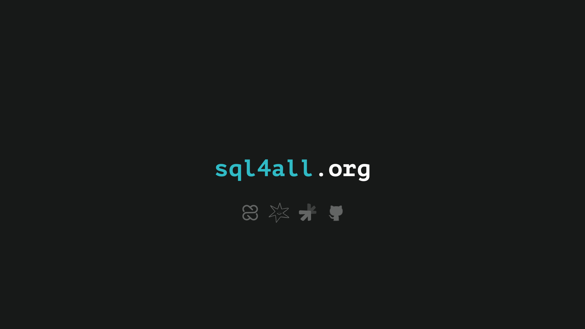

# SQL4All

[](https://pglite.dev)
[](https://www.crafterstation.com)
[](https://www.moraleja.co)
[](https://kebo.app)
[](https://github.com/camilocbarrera/sql4all)

Learn SQL by doing.

https://www.sql4all.org/

## Quick start

```bash
bun install
bun run db:push
bun dev
```

Don't forget to add `DATABASE_URL` to `.env.local`.

MIT License
